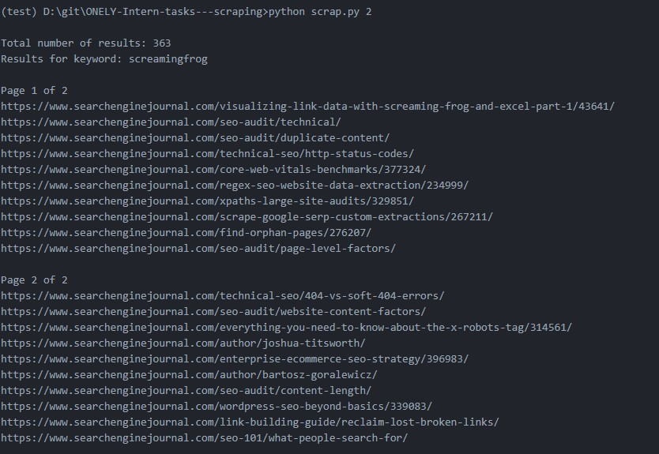
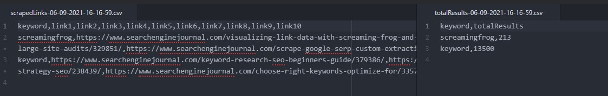

# Console Google search
Algorithm is as follows:
1. The program is looping through a list of keywords in the .txt file (keywords.txt)
2. Then it queries Google.com using the following set of queries: site:https://www.searchenginejournal.com/ {keyword}
3. For every query, the program goes through Google Search Results and extracts all the links pointing to SearchEngineJournal. We need extractions only from the first page of results but if you can get more, it would be a good addition.
4. We also want the total number of results (the number above the first result) to be extracted.
5. The program saves all the links pointing to SearchEngineJournal to a CSV file.
6. The total numbers of results should be saved in a different file along with the associated keyword.

# Quick guide for installation

1) Create virtual environment

    ```
    python -m venv venv
    ```
    > On linux:
    ```
    source venv/bin/activate
    ```
    > On windows (cmd):
    ```
    venv\Scripts\activate.bat
    ```
2) Install prerequisites
   ```
   pip install -r requirements.txt
   ```
   > See [technologies](#technologies)
3) Run script
   > On linux and Mac
    ```
    python3 scrap.py num_of_pages (if not passed set to 1)
    ```
   > On Windows (cmd)
   ```
    python scrap.py num_of_pages (if not passed set to 1)
    ```
4) Results are printed in the console and saved in .csv file. Also the total number of results for the keyword is saved (in a different file but with the same datetime stamp).

### Ideas on how the software can be improved in the future.
* Automatic navigation to the pages in the browser.
* Creating graphs for example how many of the given references actually relate to the keyword.
### Are there any risks associated with using such a program?
* If there are too many requests or the requests are sent to fast the HTTP Error 429 will be raised.
* There is a limit of queries sent per day - Error 429 will be raised.
* Google does not allow it. You can get blocked. (Problem can occur when actually scrapping the results by a certain name of div class etc.)

# Technologies
* Custom search engine set to www.searchenginejournal.com (script is already using mine)
* Python libraries: csv, requests, json, datetime

# Usage

> Total number of results and links are printed in the console.
###

> Files with extracted data are created.
